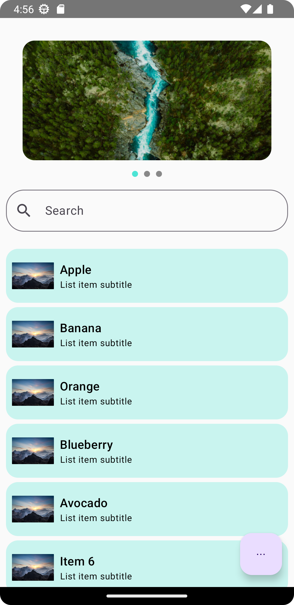

# 📱 ABCApp - Jetpack Compose Version


This branch contains the **Jetpack Compose** version of ABCApp.

## 🚀 Features

- 🎠 Horizontal image carousel using `HorizontalPager`
- 🔍 Search bar that sticks to the top while scrolling
- 📋 Static list filtered by search input
- 🧮 FAB opens a bottom sheet showing top 3 most used characters

## 🧠 Architecture

- MVVM Architecture
- UI written entirely using Jetpack Compose
- All dimensions are defined in `res/values/dimens.xml`
- All static strings are placed in `res/values/strings.xml`

## 📸 Screenshot



## 🗂️ Project Structure Highlights

```
abcapp/
└── presentation/
  - screens/
    ├── Composable.kt
    ├── MainLayout.kt
    └── MainScreen.kt
  - theme/
    └── Theme.kt            # Theming (colors, typography)
  - viewmodel/
    ├── MainViewModel.kt    # ViewModel
    └── UiState.kt
    
└── MainActivity.kt     # Main Compose Activity (Entry Point)
- res/
  └── drawable/
      ├── image1.png
      ├── image2.png
      └── image3.png
  └── values/
      ├── strings.xml
      └── dimens.xml
```

## ▶️ Run Instructions

```bash
git clone https://github.com/inder07/ABCApp.git
cd ABCApp
git checkout compose
```

Open in Android Studio (Arctic Fox or higher), then **Run** on emulator/device.

## 📌 Notes

- Only **one clean commit** on this branch
- Uses **Material 3**, **Jetpack Compose**, and **State Management**
- Screenshots and assets should be located in `/screenshots`

---

🔁 To view the XML version, switch to:
```bash
git checkout xml
```
