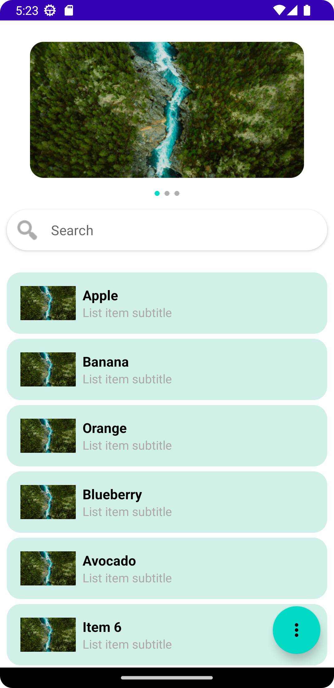

# 📱 ABCApp - XML Version


This branch contains the **XML View System** implementation of ABCApp.

---

## 🚀 Features

- 🎠 Image carousel using `ViewPager2`
- 🔍 Search bar that sticks at the top when scrolling
- 📋 Static list filtered by user input
- 🧮 Floating Action Button (FAB) opens a bottom sheet showing:
    - Total items in the current list
    - Top 3 most frequent characters in list items

---

## 🧠 Architecture

- ✅ Clean **MVVM** architecture using `ViewModel`
- ✅ UI with **ViewBinding**
- ✅ Data-driven updates via **LiveData**
- ✅ All dimensions defined in `res/values/dimens.xml`
- ✅ All static strings defined in `res/values/strings.xml`

---

## 📸 Screenshot



---

## 🗂️ Project Structure

```
abcapp/
├── presentation/
│   ├── adapter
│   ├── screens/ MainActivity.kt        # Main Android Activity (Entry Point)
│   └── viewmodel
├── res/
│   ├── layout/
│   │   ├── activity_main.xml
│   │   ├── bottom_sheet_stats.xml
│   │   ├── image_item.xml
│   │   └── list_item.xml
│   ├── drawable/
│   │   ├── dot_selected.xml
│   │   ├── dot_unselected.xml
│   │   ├── ic_baseline_more_horiz_24.xml
│   │   ├── image1.png
│   │   ├── image2.png
│   │   ├── image3.png
│   │   └── rounded_image_background.xml
│   │   └── rounded_item_background.xml
│   └── values/
│       ├── strings.xml
│       └── dimens.xml
```

---

## ▶️ Getting Started

```bash
git clone https://github.com/inder07/ABCApp.git
cd ABCApp
git checkout xml
```

Then open the project in **Android Studio (Arctic Fox or higher)** and run it on an emulator or real device.

---

## 📌 Notes

- ✅ This branch contains **only one clean commit**
- 🧠 MVVM architecture with proper separation of concerns
- ✨ Follows material design and Android best practices
- 📂 Screenshots and assets should be placed under `/screenshots/`

---

🔁 To view the Jetpack Compose version, switch to:

```bash
git checkout compose
```

---